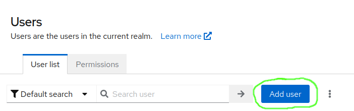

# Inhalt

1. [Gruppenerstellung](#gruppenerstellung)
2. [Rechtevergabe](#rechtevergabe)
3. [Nutzererstellung](#nutzererstellung)
4. [Nutzerbearbeitung und Gruppenzugehörigkeit](#nutzerbearbeitung-und-gruppenvergabe)

# Gruppenerstellung

Um eine neue Gruppe anzulegen, folgen Sie diesen Schritten:

1. Navigieren Sie zum ([Data-Hub-Frontend](https://mdb-frontend.data-hub.teuto.net/)).

2. Klicken Sie auf `Auth API` und melden Sie sich mit einem Konto mit Admin-Rechten (Benötigte Scopes: `tenant:admin`, `tenant:view`) an.

3. Wählen Sie aus der Liste der Ihnen zugänglichen Tenants den gewünschten Tenant aus.

   

4. Klicken Sie auf `Gruppen` und dann auf `Neue Gruppe anlegen`

5. Geben Sie den gewünschten Gruppennamen ein und klicken Sie auf `Erstellen`

   

Die Gruppe ist nun erstellt. Sie können der Gruppe jetzt Berechtigungen geben und Nutzer zuweisen.

# Rechtevergabe

Rechte werden mittels Gruppen vergeben. Wenn ein Benutzer Mitglied einer Gruppe mit bestimmten Berechtigungen ist, hat er diese Berechtigungen ebenfalls.

## Tenantebene

Um einer Gruppe Berechtigungen für einen Tenant zu geben, folgen Sie den folgenden Schritten:

1. Navigieren Sie zum ([Data-Hub-Frontend](https://mdb-frontend.data-hub.teuto.net/)).

2. Klicken Sie auf `Auth API` und melden Sie sich mit einem Konto mit Admin-Rechten (Benötigte Scopes: `tenant:admin`, `tenant:view`) an.

3. Wählen Sie aus der Liste der Ihnen zugänglichen Tenants den gewünschten Tenant aus.

4. Klicken Sie auf `Tenant Berechtigungen`

   Von hier aus können Sie entweder eine bestehende Berechtigung bearbeiten indem Sie auf die gewünschte Berechtigung klicken, oder mit einem Klick auf `Neue Berechtigung anlegen` eine neue Berechtigung erstellen.

5. Im Bearbeitungsdialog für Berechtigungen geben Sie zuerst einen Namen für die Berechtigung ein. Es empfiehlt sich, einen sprechenden Namen zu verwenden, der gut beschreibt, zu was die Berechtigung befähigt.

6. Wählen Sie nun im Dropdown `Gruppe/n` alle Gruppen aus, denen Sie die Berechtigung zuweisen wollen. Wie Sie eine Gruppe erstellen, können Sie [hier](#gruppenerstellung) nachlesen. In der Berechtigung unerwünschte Gruppen können Sie mit einem Klick auf das kleine `x` neben der Gruppe im Dropdown wieder entfernen.

   

7. Wählen Sie nun im Dropdown `Scope/s` alle Scopes aus, die die Berechtigung haben soll. Unerwünschte Scopes können Sie mit einem Klick auf das kleine `x` neben dem Scope wieder entfernen.

   

## Projektebene

Um einer Gruppe Berechtigungen für ein Projekt zu erteilen, folgen Sie diesen Schritten:

1. Navigieren Sie zum ([Data-Hub-Frontend](https://mdb-frontend.data-hub.teuto.net/)).

2. Klicken Sie auf `Auth API` und melden Sie sich mit einem Konto mit Admin-Rechten (Benötigte Scopes: `tenant:admin`, `tenant:view`) an.

3. Wählen Sie den gewünschten Tenant aus der Liste der Ihnen zugänglichen Tenants aus.

4. Klicken Sie auf `Projekte`

5. Wählen Sie das gewünschte Projekt aus oder erstellen Sie ein neues.

6. Klicken Sie auf Projekt-Berechtigungen.

   

   Hier können Sie entweder eine bestehende Berechtigung bearbeiten, indem Sie auf die entsprechende Berechtigung klicken, oder eine neue Berechtigung erstellen, indem Sie auf `Neue Berechtigung` anlegen klicken.

7. Wählen Sie im Dropdown-Menü `Gruppe/n` alle Gruppen aus, denen Sie die Berechtigung zuweisen möchten. Informationen zur Erstellung einer Gruppe finden Sie [hier](#gruppenerstellung). Um eine Gruppe zu entfernen, klicken Sie auf das kleine `x` neben der Gruppe im Dropdown-Menü.

8. Wählen Sie im Dropdown-Menü `Scope/s` alle Scopes aus, die die Berechtigung haben soll. Um unerwünschte Scopes zu entfernen, klicken Sie auf das kleine `x` neben dem Scope.

   

### Liste der Scopes

- `group:admin`: Kann Ressourcen der der Berechtigung zugewiesenen Gruppe/n verwalten
- `group:dashboard-edit`: Kann die Grafana-Dashboards der der Berechtigung zugewiesenen Gruppe/n bearbeiten
- `group:view`: Kann die Ressourcen der der Berechtigung zugewiesenen Gruppe/n sehen
- `project:admin`: Kann Ressourcen der Projekte der der Berechtigung zugewiesenen Gruppe/n verwalten
- `project:bucket-write`: Kann schreibend auf die Mimir-Buckets der der Berechtigung zugewiesenen Gruppe/n zugreifen
- `project:prometheus-read`: Kann auf Prometheus-Daten der der Berechtigung zugewiesenen Gruppe/n und deren Projekten zugreifen
- `project:prometheus-write`: Kann Prometheus-Daten und Einstellungen der der Berechtigung zugewiesenen Gruppe/n verändern
- `project:sensor-metadata-write`: **Benötigt, um data-hub Frontend zu verwenden und Projekte des Tenants dort zu sehen**
- `project:view`: Kann Projekte und deren Ressourcen der der Berechtigung zugewiesenen Gruppe/n sehen
- `sensor-credential:admin`: Kann Sensor Credentials der der Berechtigung zugewiesenen Gruppe/n verwalten
- `sensor-credential:rotate`: Kann für Projekte der der Berechtigung zugewiesenen Gruppe/n Sensor Credentials erstellen und rotieren
- `sensor-credential:view`: Kann Sensor Credentials der der Berechtigung zugewiesenen Gruppe/n sehen
- `tenant:admin`: Kann Ressourcen der Tenants der der Berechtigung zugewiesenen Gruppe/n verwalten. Beinhaltet Verwaltungsrechte für alle untergeordneten Ressourcen (Projekte, Gruppen, Sensor-Credentials)
- `tenant:view`: Kann Ressourcen eines Tenants sehen

8. Wenn Sie mit ihrer Berechtigung zufrieden sind, klicken Sie auf `Erstellen`, um die Berechtigung zu erstellen.

Nutzer, die Sie den in der Berechtigung spezifizierten Gruppen hinzufügen, erhalten nun die gewünschten Scopes und die damit verbundenen Fähigkeiten.

# Nutzererstellung

Um einen Nutzer zu erstellen und ihrem Tenant hinzuzufügen, folgen Sie diesen Schritten:

1. Melden Sie sich im Keycloak mit einem Administrator-Konto an ([Link](https://login.data-hub.teuto.net/realms/udh)).

2. Navigieren Sie zur Liste der Benutzer ("Users").

   

3. Klicken sie auf "Add User" (Benutzer hinzufügen).

   

4. Geben Sie den gewünschten Benutzernamen ein.

5. Geben Sie die E-Mail-Adresse der Person ein, für die Sie einen Benutzer anlegen wollen.

   - Optional: Geben Sie Vor- und Nachnamen der Person ein.

6. Fügen Sie den neuen Benutzer mit dem `Join Groups` Button den gewünschten Gruppen hinzu.

   - **Wenn der neue Benutzer das Data-Hub Frontend verwenden können und darin die Projekte eines Tenants sehen können soll, muss der Benutzer mindestens einer Gruppe mit dem Scope `project:sensor-metadata-write` zugewiesen werden. Wie Sie einer Gruppe diesen Scope zuweisen, können Sie [hier](#rechtevergabe) nachlesen.**

   1. Klicken Sie dazu zuerst in der Zeile des gewünschten Tenants auf den kleinen Pfeil

      

   2. Setzen Sie dann bei allen gewünschten Gruppen einen Haken und klicken Sie auf `Join`

      

7. Klicken Sie auf "Create" (Kreieren/Anlegen).

8. Navigieren Sie zum "Credentials"-Tab.

   

9. Klicken Sie auf den "Credential Reset"-Knopf unter dem "Set password"-Knopf.

   

10. Wählen Sie im "resetAction"-Dropdown im auftauchenden Popup die Optionen "Update Password" und "Verify Email" aus.

    - Optional: Falls Sie nicht erwarten, dass Ihre Benutzer ihre E-Mails regelmäßig prüfen, können Sie den Wert im "Expires in"-Feld auf einen Wert setzen, der Ihnen sinnvoll erscheint. Der Link, der Ihrem neuen Benutzer geschickt wird, verliert nach Ablauf dieser Zeitspanne seine Gültigkeit.

11. Klicken Sie auf den "Send Email"-Knopf.

Fertig! Ihr neuer Benutzer wird jetzt bei der E-Mail-Adresse die Sie angegeben haben eine E-Mail erhalten, die ihn dazu anhält, seine E-Mail-Adresse zu bestätigen und ein Passwort zu setzen.

# Nutzerbearbeitung und Gruppenvergabe

Um einen bereits bestehenden Benutzer zu bearbeiten und/oder dessen Gruppenzugehörigkeit zu verwalten, folgen Sie diesen Schritten:

1. Melden Sie sich im Keycloak mit einem Administrator-Konto an ([Link](https://login.data-hub.teuto.net/realms/udh)).

2. Navigieren Sie zur Liste der Benutzer ("Users").
   

3. Wählen Sie den gewünschten Benutzer aus der Liste aus.

4. Nehmen Sie die gewünschten Änderungen an den Daten des Benutzers vor. Wenn Sie damit fertig sind, klicken Sie auf `Save`, um sie zu speichern.

5. Um die Gruppenzugehörigkeit des Benutzers zu verwalten, klicken Sie auf den Tab `Groups`.

- Wenn Sie den Benutzer aus einer Gruppe entfernen wollen, identifizieren Sie die Gruppe in der Tabelle und klicken Sie an der rechten Seite der korrespondierenden Zeile auf `Leave`.
- 1. Wenn Sie den Benutzer einer neuen Gruppe hinzufügen wollen, klicken Sie auf `Join Group`
  2. In der Zeile des Tenants, dessen Gruppe Sie den Benutzer hinzufügen wollen, klicken Sie auf den kleinen Pfeil an der rechten Seite
     

  3. Setzen Sie einen Haken bei allen Gruppen, denen Sie den Benutzer hinzufügen wollen und klicken Sie auf `Join`
     
