# Inhalt

- [Sensor Credentials](#sensor-credentials-anlegen)
- [TTN Webhook anlegen](#ttn-webhook)
- [Sensoreinrichtung Data-Hub Frontend](#sensoreinrichtung-im-data-hub-frontend)
- [Sensorinstallation verifizieren](#sensorinstallation-und-daten-in-grafana-verifizieren)
  - [Fehlersuche](#fehlersuche)
    - [TTN Webhook Health](#ttn-webhook-health)
    - [LoRaWAN Receiver Logs](#lorawan-receiver-logs)
    - [Max Retry Counts](#max-retry-counts)

# Sensor Credentials anlegen

1. Melden Sie sich mit einem Administratorkonto im [Data Hub Frontend](https://mdb-frontend.data-hub.teuto.net/) an.

2. Klicken Sie auf **Auth API**.

3. Wählen Sie den gewünschten Tenant.

4. Klicken Sie auf **Projekte**.

5. Wählen Sie das gewünschte Projekt.

6. Wählen Sie im Dropdown **Token auswählen** die Option "Neu erstellen" und klicken Sie auf **Token erzeugen**.

   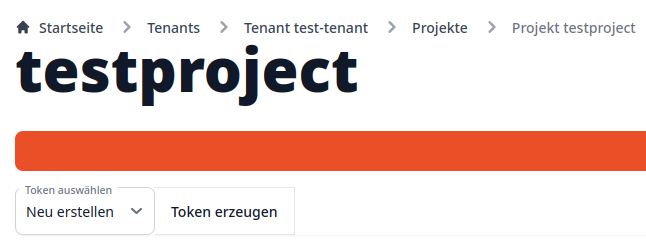

7. Ein Popup erscheint; Geben Sie dort den gewünschten Token-Namen ein und klicken Sie auf **Token erzeugen**.

**ACHTUNG! Die nun angezeigten Zugangsdaten können Sie sich nicht noch einmal anzeigen lassen! Speichern Sie diese daher sicher ab oder fahren Sie sofort in einem weiteren Fenster/Tab mit der Einrichtung der Webhook fort, für die Sie diese Zugangsdaten benötigen!**
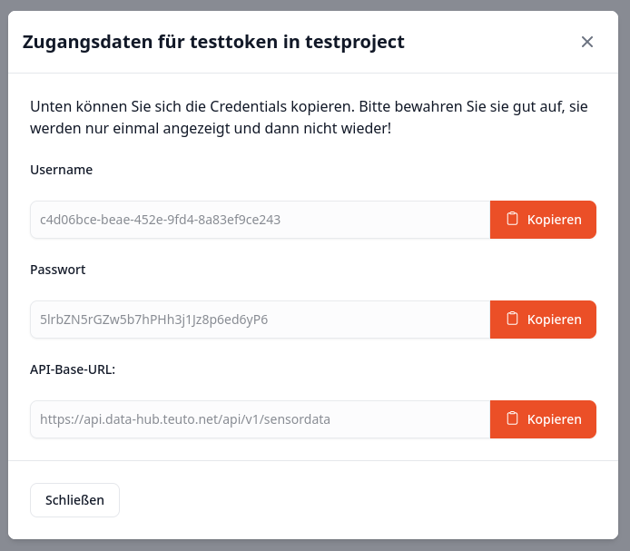

Außerdem wird hier die Base-Url angezeigt, die zur Einrichtung im TTN im [nächsten Abschnitt](#ttn-webhook) benötigt wird.

Falls Sie die Zugangsdaten eines Tokens verloren haben sollten, können Sie das Token aus dem Dropdown auswählen und mit einem Klick auf **API-Token erneuern** neue Zugangsdaten generieren. **Vorher mit diesem Token eingerichtete Webhooks müssen dann mit den neuen Zugangsdaten aktualisiert werden!**

# TTN Webhook

1. Navigieren Sie zu [thethingsnetwork.org](thethingsnetwork.org) und melden Sie sich mit Ihrem Benutzerkonto an.

2. Klicken Sie nach der Anmeldung oben rechts in der Ecke auf Ihren Benutzernamen und dann auf den Menüpunkt `Console`.

   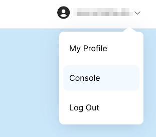

3. Wählen Sie aus der Liste **Existing Clusters** die Option **Europe 1**.

   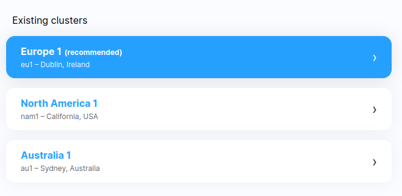

   1. Sie können nun eine Anmelde-Meldung für "The Things Stack" bekommen. Klicken Sie auf den Button **Continue as \<Ihre E-Mail-Adresse\>**.

4. Wählen Sie den Menüpunkt **Go to Applications** und wählen Sie dann aus der Liste die Application aus, für die Sie eine Webhook anlegen wollen. Falls Sie noch keine Application haben, legen Sie zuerst eine an.

5. Klicken Sie auf der linken Seite auf den Menüpunkt **Integrations**, und dann auf den Unterpunkt **Webhooks**.
   Auf dieser Seite werden Ihnen die bereits bestehenden Webhooks der gewählten Application angezeigt.

   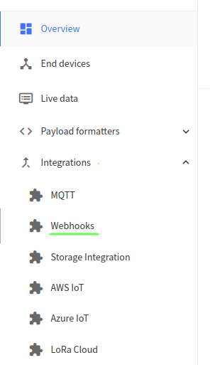

6. Um eine neue Webhook anzulegen, klicken Sie nun auf den **Add Webhook**-Button in der oberen rechten Ecke.

   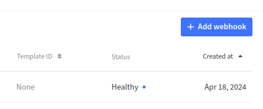

7. Klicken Sie auf **Custom Webhook**.

   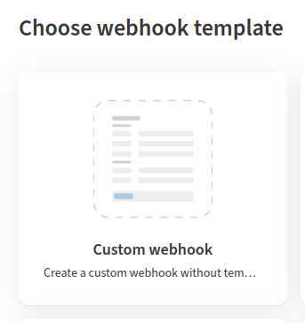

8. Füllen Sie alle mit einem Sternchen markierten Pflichtfelder aus. Das Feld **Base URL** muss mit `https://api.data-hub.teuto.net/api/v1/sensordata` gefüllt werden.

   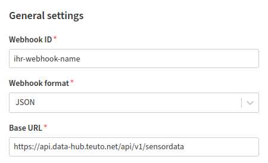

9. Setzen Sie einen Haken bei der Option **Use basic access authentication (basic auth)**.

10. Füllen Sie die Felder **Username** und **Password** mit den Sensor Credentials für das Projekt, für das Sie die Webhook anlegen wollen. Wie Sie diese Sensor Credentials anlegen oder rotieren, können Sie [hier](#sensor-credentials-anlegen) nachlesen.

    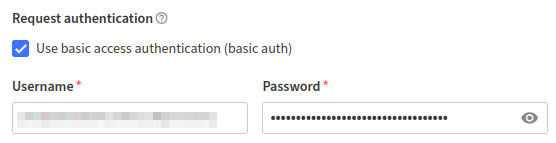

11. Setzen Sie einen Haken bei der Option **Uplink message**

12. Klicken Sie auf den Button **Add webhook**.

Fertig! Die Webhook ist nun angelegt.

# Sensoreinrichtung im Data Hub Frontend

1. Melden Sie sich mit einem Administratorkonto im [Data Hub Frontend](https://mdb-frontend.data-hub.teuto.net/) an.

2. Wählen Sie das Projekt, in dem der neue Sensor eingerichtet werden soll.

3. Klicken Sie entweder oben in der Navigationsleiste oder auf der Übersichtsseite auf den Punkt **Neue Sensoren**.

Nach ein paar Minuten sollten über Webhooks angemeldete Sensoren in der Liste erscheinen. Es kann sein, dass Sie dafür die Seite mehrfach aktualisieren müssen.

4. Wählen Sie den Sensor, den Sie einrichten wollen.

5. Vergewissern Sie sich, dass alle Metadaten des Sensors korrekt sind, die über die Webhook angeliefert wurden, wie z.B. Ortsangaben und DevEUI.

   1. Wenn Sie bereits Sensortypen eingerichtet haben und der Sensor in der Payload Daten anliefert, wählt das System automatisch den korrekten Sensortypen aus wenn die übermittelten Eigenschaften sich perfekt decken und die Zuordnung eindeutig ist. Falls es mehrere Möglichkeiten gibt, können Sie mit einem Klick auf **Sensortyp finden** um eine Liste aller in Frage kommenden Sensortypen angezeigt zu bekommen. Dort können Sie dann den passenden Typen auswählen.

      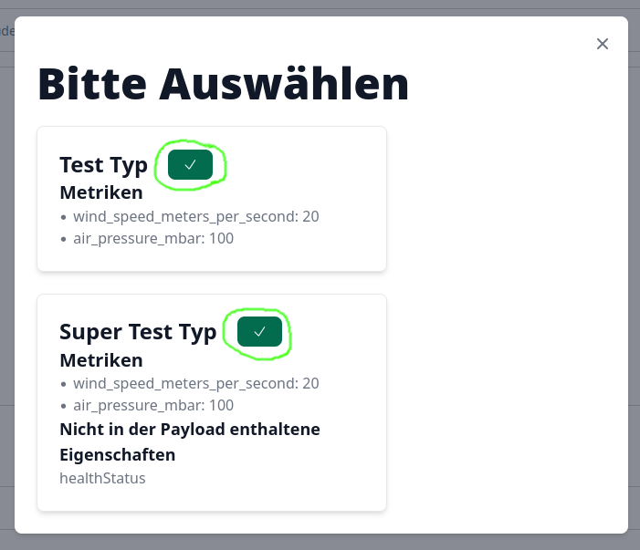

Die Metriken der Sensoreigenschaften werden in Grafana als Metriknamen angezeigt.

6. Mit einem Klick auf **Speichern & Sensor aktivieren** werden Ihre Änderungen gespeichert und der Sensor zur Benutzung freigegeben. Alternativ können Sie auch lediglich Ihre Änderungen speichern, indem Sie auf **Änderungen Speichern** klicken (in diesem Fall muss der Sensor zur Verwendung später noch aktiviert werden).

Damit ist der Sensor im Data Hub Frontend eingerichtet.

# Sensorinstallation und Daten in Grafana verifizieren

Um zu prüfen ob Ihre neu eigerichteten Sensoren korrekt Daten anliefern, gehen Sie wie folgt vor:

1. Melden Sie sich mit einem Administratorkonto im [Data Hub Frontend](https://mdb-frontend.data-hub.teuto.net/) an.

2. Klicken Sie auf **Grafana Dashboard**

   1. Falls Sie bei mehreren Tenants oder Projekten Administratorrechte haben, wählen Sie aus dem Dropdown in der oberen linken Ecke den gewünschten Tenant aus.

      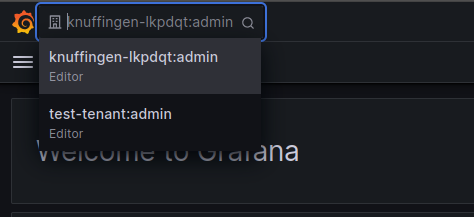

3. Klicken Sie in der oberen rechten Ecke auf **Add** und dann auf **Visualization**. Sie sehen nun den Bearbeitungsdialog für neue Grafana-Panels.

   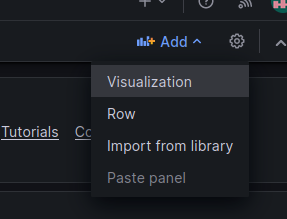

4. Wählen Sie im Dropdown **Data source** unten im **Query**-Tab **Prometheus** aus.

   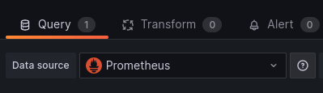

5. Wählen Sie im Dropdown **Metric** die gewünschte Metrik aus. Wenn die Einrichtung im Data Hub Frontend korrekt ist, werden neue Metriken hier automatisch erscheinen.

6. Wählen Sie dann im Dropdown **Label filters** `devid`, `=` und die dev-ID ihres Sensors.

   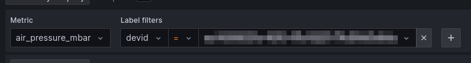

7. Mit dem Button **Run queries** können Sie dann testen, ob der Sensor schon Daten angeliefert hat. Je nachdem wie Sie das Report-Intervall ihres Geräts eingestellt haben, kann es bis zu der Zeitspanne des Intervalls dauern, bis Daten ankommen. Diese werden dann direkt oben in der Visualisierung angezeigt.

   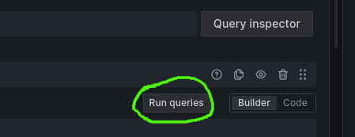

8. Verifizieren Sie, dass die Daten, die Grafana Ihnen anzeigt, plausibel sind und mit denen Ihres Sensors übereinstimmen.

Wenn die Daten in Grafana ankommen und plausibel sind, ist der Sensor korrekt eingerichtet. Falls nicht, fahren Sie mit der Fehlersuche fort.

## Fehlersuche

### TTN Webhook Health

1. Melden Sie sich wie [oben](#ttn-webhook) in den Schritten 1-6 beschrieben bei TheThingsNetwork an.

2. Suchen Sie nun in der Liste der Webhooks die fehlerhafte Webhook.

Wenn hier schon in der Spalte **Status** ein anderer Status als `Healthy` angezeigt wird, ist wahrscheinlich die Einrichtung der Webhook oder die API der Data Hub Plattform fehlerhaft. Klicken Sie auf die Webhook und prüfen Sie Ihre Eingaben. Korrigieren Sie etwaige Fehler. Falls dort alles korrekt sein sollte, liegt der Fehler bei der Data Hub Plattform. Melden Sie diesen bitte umgehend.

### Max Retry Counts

//TODO: Figure out where those are set

//TODO: errors in TTN, lorawan-receiver logs, max retry counts!
