# Sensortype Import/Export

## Kurzfassung

Vorhandene Sensortypen können über einen Knopfdruck als [JSON](https://www.w3schools.com/whatis/whatis_json.asp) ausgegeben und kopiert werden.  
Die JSON kann nun in einem anderen Projekt über ein Popup eingefügt und importiert werden.  
Dabei werden Sensoreigenschaften, soweit vorhanden, entweder automatisch hinzugefügt oder neu erstellt.

## Sensortyp exportieren

1. Wechseln Sie zum '**Sensortypen**'-Tab.

   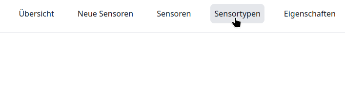

2. Öffnen Sie die Bearbeitungsseite für den zu exportierenden Sensor. Klicken Sie hierzu auf den Sensortypen.

   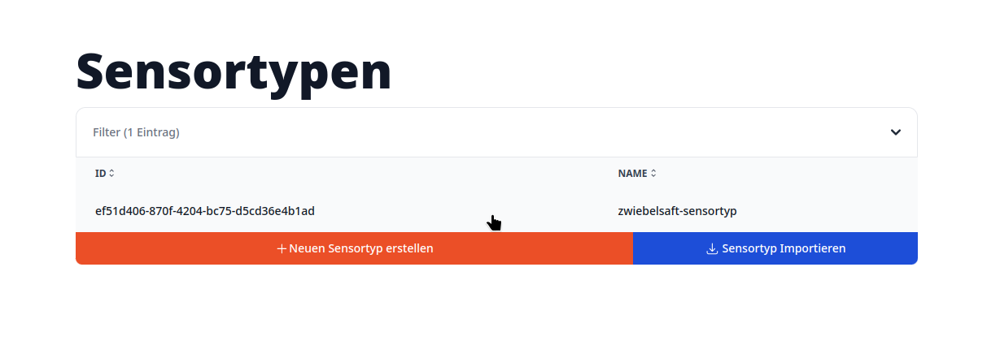

3. Klicken Sie auf den blauen Button '**Exportieren**'.

   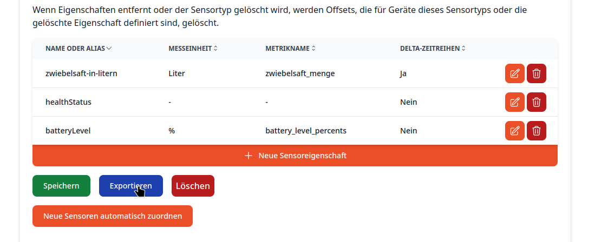

4. Es öffnet sich ein Popup. Klicken Sie nun auf den orangengen Button '**Kopieren**' um die JSON-Sensortypkonfiguration in die Zwischenablage zu kopieren.

   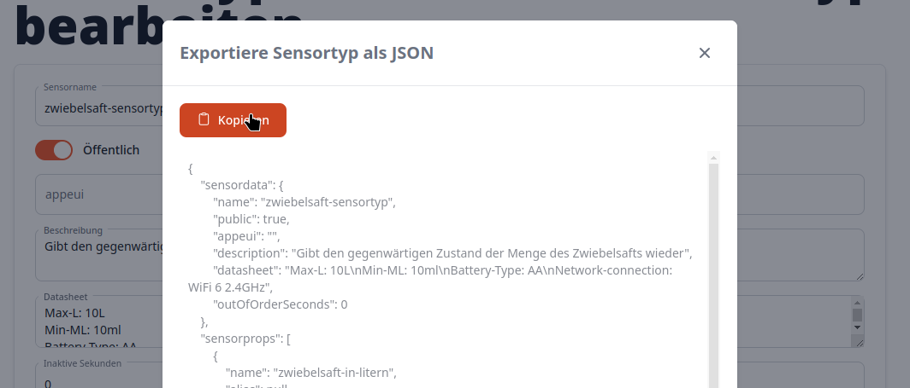

## Sensortyp importieren

_Wechseln Sie ggf. das Projekt_.

1. Wechseln Sie zum '**Sensortypen**'-Tab.

   

2. Klicken Sie auf die blaue Fläche '**Sensortyp Importieren**'.

   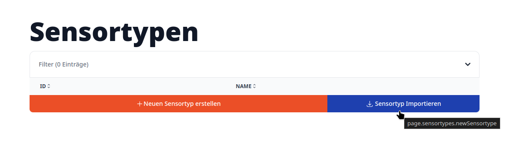

3. Es öffnet sich ein Eingabe-Popup. Klicken Sie auf das Eingabefeld.

   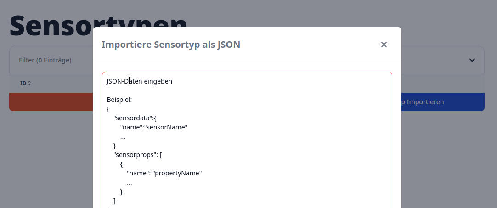

4. Fügen Sie die JSON mit der Sensortypkonfiguration in das Eingabefeld ein.  
   Klicken Sie, soweit alles in Ordnung ist, auf den Button '**Importieren**'.

   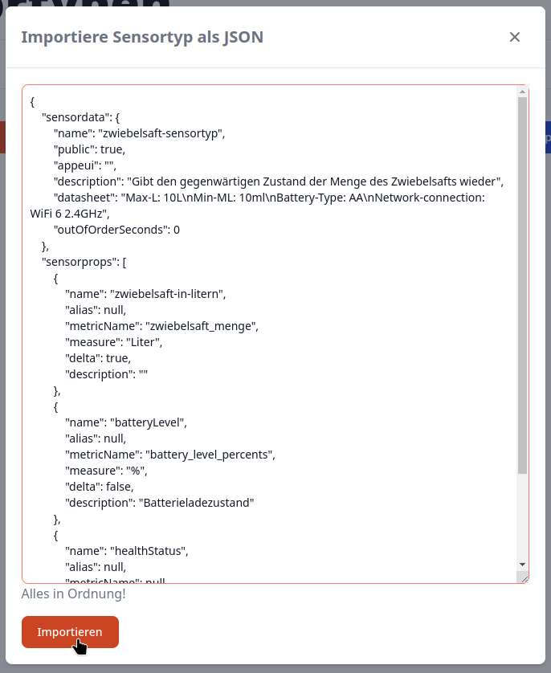

5. Es öffnet sich die Bearbeitungsseite für den importierten Sensortyp.
   Die in dem Projekt bereits vorhandenen Sensoreigenschaften werden automatisch zugeordnet (z.B. globale Eigenschaften).  
   Nicht vorhandene Eigenschaften werden für das Projekt automatisch erstellt und zugeordnet.

   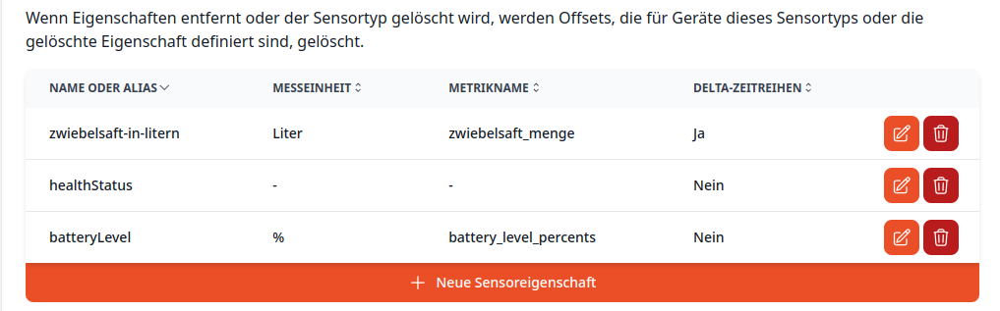
   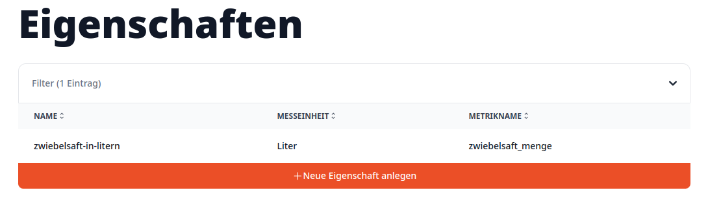

## Fehlerbehebung

Es können Fehler beim Ex-/Importieren auftreten.

Übliche Fehler sind meist invalide/unvollständige JSON-Daten
aber auch Importfehler durch gleichnamige Sensortypkonfigurationen können einen Fehler auslösen.

Diese Fehler können mit den folgenden Lösungsvorschlägen behoben werden.  
Bei bestehenden Problemen kontaktieren Sie den Support!

### Fehler beim Importieren

#### Der '**Importieren**' Button ist deaktiviert:

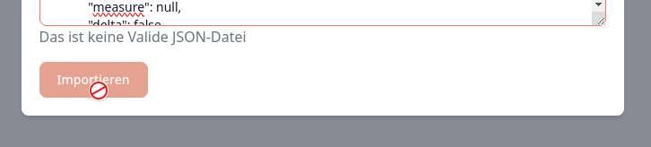

- Die [JSON](https://www.w3schools.com/whatis/whatis_json.asp)-Daten sind fehlerhaft.  
  -> Prüfen Sie die JSON-Daten auf Richtigkeit/Vollständigkeit  
  -> Exportieren Sie die Konfiguration ggf. erneut und versuchen Sie es nochmal

#### Fehlermeldung nach der Eingabe und anchließendem Klick auf '**Importieren**' im Import-Popup:

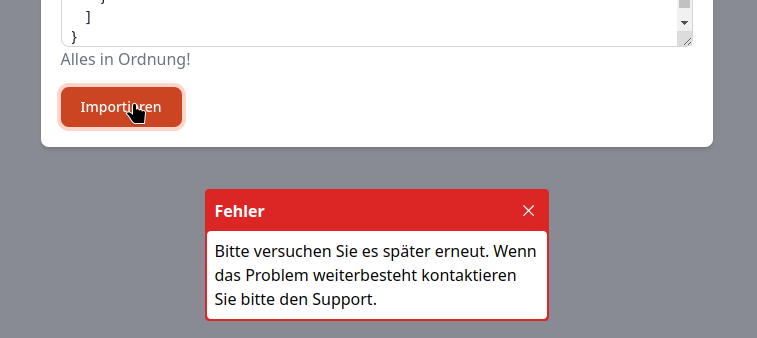

- Die JSON-Daten sind fehlerhaft.  
  -> Prüfen Sie die eingegebenen JSON-Daten auf Richtigkeit/Vollständigkeit.

- Es gibt bereits einen Sensortypen mit demselben Namen.  
  -> Verändern Sie den Sensortyp-Namen innerhalb der JSON-Daten  
  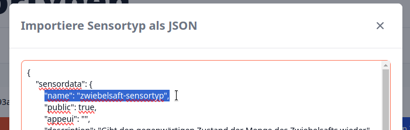

#### Die Sensoreigenschaften werden nicht mitimportiert:

- Die [JSON](https://www.w3schools.com/whatis/whatis_json.asp)-Daten sind fehlerhaft.  
  -> Prüfen Sie die JSON-Daten auf Richtigkeit/Vollständigkeit  
  -> Vergewissern Sie sich, dass die '**sensorprops**' in den JSON-Daten existieren und Eigenschaften in dieser Liste vorhanden sind

### Fehler beim Exportieren

#### Die Konfiguration wird nicht bzw. unvollständig in [JSON](https://www.w3schools.com/whatis/whatis_json.asp) exportiert:

- Laden Sie die Seite ggf. neu und probieren Sie es nochmal
- Kontaktieren Sie den Support
